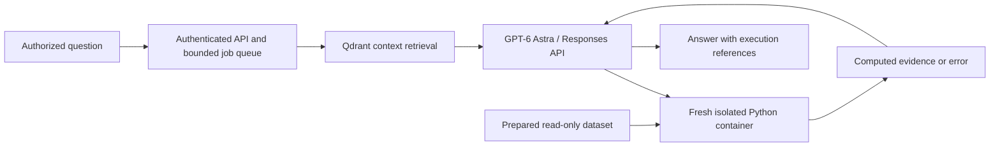

# Analytics Investigation Assistant

An authenticated analytics service using **GPT-6 Astra**, **Qdrant**, and isolated
Python execution. It prepares Online Retail II data, retrieves relevant schema and
metric definitions, computes evidence over the full dataset, and answers with
execution references. Complex investigations can revise failed code within fixed limits.

**Release status:** deployment-ready candidate for one organization on one host.
Automated tests, live Docker isolation, full-dataset computation and local Qdrant
indexing have been exercised. Live Astra answer validation is blocked by the current
OpenAI account's exhausted API credits. See [validation](docs/VALIDATION.md).
This repository ships the application; Astra remains an API-hosted model, not
downloadable model weights.

## Architecture



- **Reasoning:** `gpt-6-astra`, `high` effort, structured Responses API actions,
  provider retries/timeouts, output limits and a cumulative token budget.
- **Retrieval:** Qdrant with local `BAAI/bge-small-en-v1.5` embeddings (384 dimensions).
  No OpenAI credits are needed for local embeddings. `text-embedding-3-small` is
  optional. Versioned collections include dataset/context hashes and embedding
  configuration; stale indexes fail explicitly.
- **Accuracy:** retrieval supplies definitions and quality context. Python scans
  the full transaction file for totals; nearest rows never estimate whole-dataset
  totals. Final answers must reference successful execution evidence.
- **Execution:** non-root Docker, no network, read-only source/root, no capabilities
  or privilege escalation, 2 GB RAM, one CPU, 64 processes, bounded temporary
  storage, timeout, output limit and cleanup. No host-execution fallback.
- **Service:** bearer auth, validated inputs, request-size limit, bounded queue,
  SQLite job persistence, restart interruption reporting and readiness checks.
- **Delivery:** hash-locked dependencies, pinned sandbox base image, tests,
  vulnerability audit, GitHub Actions and Dependabot.

## Start on this Mac

The `analytics` Colima VM and authenticated Qdrant container were installed for this
task. Private `.env` contains local service tokens. The existing OpenAI key is read
from `OPENAI_API_KEY`; it was not copied into Git.

```sh
colima start --profile analytics --cpu 2 --memory 4 --disk 20 --vm-type vz --mount-type virtiofs --activate=false
.venv/bin/python -m investigation.cli serve
```

The API listens on `127.0.0.1:8000`. Run one worker. If the task's development server
is still running, use it rather than starting another process. `.env` selects
`DOCKER_CONTEXT=colima-analytics`; the machine's default Docker context is unchanged.

## Clean installation

Requires Python 3.12, Docker and a funded OpenAI project with Astra access.

```sh
python3.12 -m venv .venv
.venv/bin/python -m pip install --require-hashes -r requirements.lock
.venv/bin/python scripts/configure_local.py
```

Set `OPENAI_API_KEY` through a secret manager or shell environment. The setup script
generates local assistant/Qdrant tokens without displaying them. See `.env.example`.
On Linux/ordinary Docker remove `DOCKER_CONTEXT` from `.env`. For a Mac without a
runtime, run `sh scripts/setup_macos.sh`.

The workbook and prepared data deliberately stay out of Git:

```sh
.venv/bin/python preprocess.py /path/to/online_retail_II.xlsx --output output
docker --context colima-analytics build -t retail-agent-sandbox:local .
.venv/bin/python -m scripts.start_qdrant
.venv/bin/python -m investigation.cli index
.venv/bin/python -m investigation.cli serve
```

Omit Docker `--context` on Linux. The local embedding model downloads on first
indexing and is cached in `state/embedding-cache`. Preserve that cache with its
index or rebuild after upgrading the model. Output preparation directories must be new.

## Ask a question

```sh
.venv/bin/python -m investigation.cli ask "Compare positive sales and returns by month. Explain partial-period and missing-customer limitations."
```

API usage from a trusted client, with the service token in its environment:

```python
import os
import requests

headers = {"Authorization": "Bearer " + os.environ["ASSISTANT_API_TOKEN"]}
response = requests.post("http://127.0.0.1:8000/v1/investigations", headers=headers,
    json={"question": "Which countries account for the largest change in net signed line value?"},
    timeout=10)
response.raise_for_status()
job = response.json()
status = requests.get("http://127.0.0.1:8000" + job["status_url"], headers=headers, timeout=10)
print(status.json())
```

Poll until `complete`, `failed`, `step_limit` or `interrupted`. Results contain the
model, data fingerprint, executed code, computed outputs, evidence IDs and token
usage. They may contain business data and share the organization token's access
boundary. A full queue returns 429. Provider failures do not switch models or
fabricate answers.

Endpoints: `GET /healthz`; authenticated `GET /readyz`, `POST /v1/investigations`,
`GET /v1/investigations/{uuid}`. Readiness checks index/image availability, not API
billing. There is no public arbitrary-file or remote-database execution endpoint.

## Preparation policy

The supplied workbook produced **1,067,371 invoice lines**. Missing customer IDs
(243,007) and descriptions (4,382) remain null. Returns/cancellations (22,951), IQR
outliers (190,616) and later within-sheet exact duplicates (12,133) are flagged.
Counts overlap. The default required-field rule rejected no rows.

Headers map to a fixed retail schema. IDs remain text; prices/quantities are numbers;
dates are ISO timestamps. Unknown, missing or colliding columns fail. Exact
whole-cell NA tokens become null; substrings such as BANANA survive. Invalid values
are reported. Numeric date serials are rejected instead of guessing an epoch.
Original source sheets and worksheet rows remain traceable.

| Option | Behavior |
|---|---|
| `--missing required` | Default: reject missing invoice, stock code, quantity, date or price |
| `--missing keep` | Retain missing values in every field |
| `--missing any` | Reject rows with any missing source field |
| `--outliers keep` | Default: retain and flag per-sheet 1.5×IQR outliers |
| `--outliers drop` | Reject flagged outliers with recorded reasons |
| `--deduplicate` | Reject later exact duplicates within each sheet |

Outliers may be valid bulk purchases or returns. Currency/timezone are unspecified.
Signed `line_value` is quantity × price, not audited revenue. Use decimal arithmetic
for exact financial reconciliation. Workbook/retrieved text never overrides user instructions.

Outputs: `cleaned.jsonl`, `rejected.jsonl`, `schema.json`, `quality_report.json`,
`llm_context.json`. Keep these in approved private storage. Do not paste the entire
transaction file into an LLM prompt. `features.py` retains optional train-only
imputation/scaling/encoding; these are not applied to LLM context. `database.py`
provides read-only SQLite and trusted SQLAlchemy ingestion. Remote credentials and
generated remote SQL are never passed into the execution container.

## Operations and validation

See [deployment](docs/DEPLOYMENT.md), [security](SECURITY.md) and
[validation](docs/VALIDATION.md). Configure provider spending limits. This initial
version is single-organization/single-host. Distributed workers, multi-tenant auth
and public internet hosting need deployment-specific work.

```sh
.venv/bin/python -m pytest -q
.venv/bin/python -m ruff check .
.venv/bin/python -m scripts.smoke_sandbox
.venv/bin/python -m scripts.smoke_dataset
.venv/bin/python -m scripts.smoke_api
# Paid end-to-end model evaluation after funding the OpenAI account:
.venv/bin/python -m scripts.live_investigation
```

The full-dataset/live-investigation baselines apply to the supplied workbook.
GitHub CI uses synthetic data and no private dataset or OpenAI key. Secrets, data,
model caches and execution traces are ignored by Git.

## References

- [GPT-6 Astra](https://developers.openai.com/api/docs/models/gpt-6-astra)
- [Astra/Responses guidance](https://developers.openai.com/api/docs/guides/latest-model)
- [Structured outputs](https://developers.openai.com/api/docs/guides/structured-outputs)
- [Qdrant](https://qdrant.tech/documentation/quickstart/)
- [FastEmbed](https://qdrant.tech/documentation/fastembed/fastembed-quickstart/)
- [Docker runtime controls](https://docs.docker.com/engine/containers/run/)
